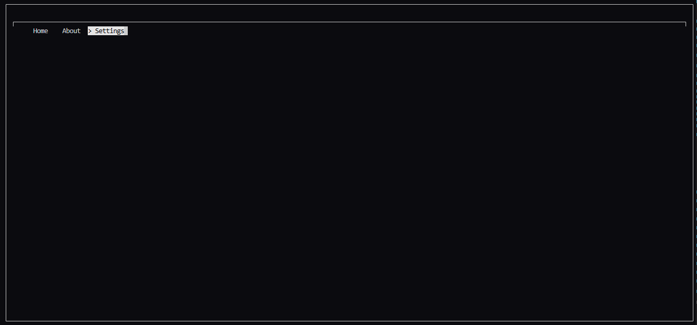

# Termin

# 🧮 Termin – A Minimalist TUI from Scratch in Rust

**Termin** is a low-level, dependency-free **Text User Interface (TUI)** toolkit built entirely from scratch in Rust.  
It aims to provide full control over terminal rendering and interaction, using native system calls and ANSI escape sequences—no crates like `crossterm`, `tui-rs`, or `ratatui`.

---

## 🚀 Current Status

- ✅ **Windows support** via the [`windows`](https://crates.io/crates/windows) crate (Win32 API).
- 🔜 **Unix/Linux support** in progress using direct bindings to `libc`.
- 🖋️ Basic redrawing via **ANSI escape codes**.
- 🎨 Style system with `Bold`, `Italic`, `Underline`, etc.
- 🧱 Modular component structure using dynamic dispatch (`Box<dyn Component>`).

---

## 🎯 Goals

- Build a fully featured terminal UI engine from scratch.
- Avoid visual dependencies and keep low-level control.
- Learn and document how terminal rendering works under the hood.
- Ensure portability across Windows and Unix systems.

---
